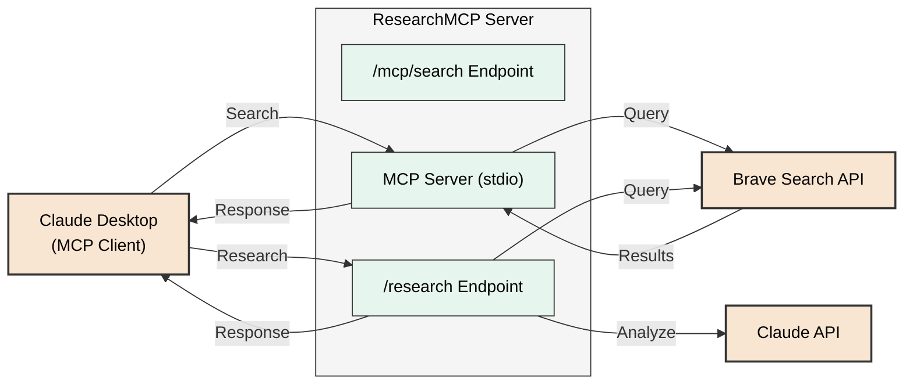

# ResearchMCP

A research tool that combines Model Context Protocol (MCP) and Brave Search to achieve research
functionality equivalent to ChatGPT's DeepResearch.

## Technology Stack

- **Runtime**: Deno
- **Framework**: Hono
- **Error Handling**: Neverthrow (Result<T, E> pattern)
- **Deployment**: Docker container

## Setup

### Local Development

1. Install [Deno](https://deno.land/)
2. Clone the repository
3. Set environment variables
   - `BRAVE_API_KEY`: Brave Search API key
   - `CLAUDE_API_KEY`: Claude API key (optional)
4. Run the application:
   ```
   make dev  # HTTP server
   make mcp  # MCP server for Claude Desktop
   ```

### Container Environment

1. Install Docker and Docker Compose
2. Set environment variables in a `.env` file
3. Build and run the container:
   ```
   make d-build
   make d-up
   ```

## Development Commands

```bash
# Local development
make dev     # Start HTTP server with watch mode
make mcp     # Start MCP server for Claude Desktop
make test    # Run tests
make lint    # Run linter
make format  # Format code
make check   # Type check

# Docker development
make d-build  # Build the image
make d-dev    # Start container with live reload
make d-up     # Run in background
make d-logs   # View logs
make d-down   # Stop container
```

## MCP Integration with Claude Desktop

1. Run the MCP server: `make mcp`
2. In Claude Desktop, add a new MCP server with the following configuration:

   ```json
   {
     "mcpServers": {
       "BraveSearch": {
         "description": "Web search powered by Brave Search API",
         "command": "/absolute/path/to/ResearchMCP/cli.ts",
         "args": [],
         "transport": "stdio",
         "env": {
           "BRAVE_API_KEY": "your_brave_api_key_here"
         }
       }
     }
   }
   ```

   Replace `/absolute/path/to/ResearchMCP/cli.ts` with the actual path to the cli.ts file.

### Known Limitations

- **Language Support**: Brave Search API has limited support for non-Latin characters. Searches in Japanese, Chinese, Korean, and other non-Latin script languages may fail with encoding errors. For best results, use English queries.

### Features

- **Web Search**: Search the web using Brave Search API through Claude Desktop
- **MCP Protocol**: Full compliance with the Model Context Protocol
- **Caching**: Search results are cached to improve performance and reduce API calls
- **Research**: Enhanced analysis of search results (with Claude API key)

## Architecture Overview



The MCP server provides a search tool that can be used by Claude to perform web searches through
Brave Search API. It implements the core `search` tool functionality along with minimal implementations
of `resources` and `prompts` capabilities for compatibility.
