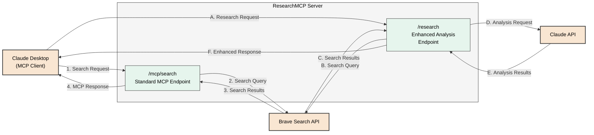
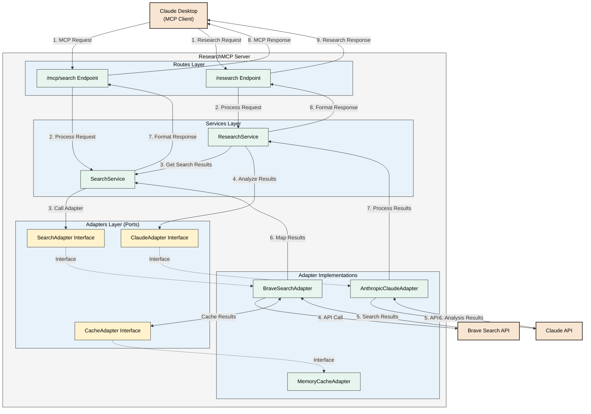

# ResearchMCP

A research tool that combines Model Context Protocol (MCP) and Brave Search to achieve research
functionality equivalent to ChatGPT's DeepResearch.

## Technology Stack

- **Runtime**: Deno
- **Framework**: Hono
- **Error Handling**: Neverthrow (Result<T, E> pattern)
- **Validation**: Hono's built-in validator (extended as needed)
- **Deployment**: Docker container

## Setup

### Local Development

1. Install [Deno](https://deno.land/)
2. Clone the repository
3. Set environment variables
   - `BRAVE_API_KEY`: Brave Search API key
   - `CLAUDE_API_KEY`: Claude API key (optional)
4. Initialize the local development environment:

   ```
   make local-init
   ```

5. Run the application locally:

   ```
   make local-dev
   ```

### Container Environment

1. Install Docker and Docker Compose
2. Set environment variables
   - `BRAVE_API_KEY`: Brave Search API key
   - `CLAUDE_API_KEY`: Claude API key (optional)
3. Build and run the container:

   ```
   make d-build
   make d-up
   ```

## Project Structure

- `src/`: Source code
  - `routes/`: API route definitions
  - `services/`: Business logic
  - `types/`: Type definitions
  - `utils/`: Utility functions
- `tests/`: Test files
- `.rules/`: Project requirements and rules
- `docker/`: Docker-related files

## Development Workflow

### Local Development

For local development without Docker:

```bash
# Start the development server with watch mode
make dev

# Run tests
make test

# Run linter
make lint

# Format code
make format

# Type check
make check
```

### Docker-based Development

For development inside Docker (recommended for consistent environment):

```bash
# Build the Docker image
make d-build

# Start the container in foreground with live reloading
make d-dev

# Run in background
make d-up
make d-logs

# Stop the container
make d-down
```

The Docker setup includes volume mounts for the project directory, so any code changes will be
immediately reflected in the running container.

## Hybrid Development Approach

This project supports a hybrid development approach where you can:

1. Use your local IDE/editor for code editing
2. Run the application and tests either locally or in a container
3. Share dependencies and configurations consistently

Choose the workflow that best suits your preferences and needs.

## Environment Variables

Create a `.env` file with the following variables:

```
BRAVE_API_KEY=your_brave_search_api_key
CLAUDE_API_KEY=your_claude_api_key
```

These will be automatically loaded by Docker Compose in container mode.

## System Architecture

### High-Level Overview

The following simplified diagram shows the key components and external relationships:



This simplified diagram focuses on how the system interacts with external components:

1. **Standard MCP Flow** (Numbers 1-4):
   - Claude Desktop sends a search request to the standard MCP endpoint
   - The server queries Brave Search API and returns formatted results

2. **Enhanced Research Flow** (Letters A-F):
   - Claude Desktop sends a request to the research endpoint
   - The server queries Brave Search API for results
   - The results are sent to Claude API for analysis and summarization
   - An enhanced response with summary, insights, and sources is returned

### Detailed Architecture

The following detailed diagram illustrates the complete system architecture and data flow:



### Architecture Explanation

1. **Client Interaction**:
   - Claude Desktop (or any MCP-compatible client) sends requests to the ResearchMCP server
   - Two main endpoints are available:
     - `/mcp/search`: Standard MCP-compliant search endpoint
     - `/research`: Enhanced endpoint with Claude-powered analysis

2. **Layered Architecture**:
   - **Routes Layer**: Handles HTTP requests/responses and validation
   - **Services Layer**: Contains business logic for search and research
   - **Adapters Layer**: Defines interfaces (ports) for external dependencies
   - **Implementations**: Concrete implementations of the adapter interfaces

3. **Data Flow**:
   - **MCP Flow**: Client → MCP Endpoint → SearchService → BraveSearchAdapter → Brave API → Client
   - **Research Flow**: Client → Research Endpoint → ResearchService → SearchService + ClaudeAdapter → Client

4. **Port and Adapter Pattern**:
   - Core application logic is isolated from external dependencies
   - Interfaces (SearchAdapter, CacheAdapter, ClaudeAdapter) define the "ports"
   - Implementations (BraveSearchAdapter, MemoryCacheAdapter, AnthropicClaudeAdapter) provide concrete implementations

This architecture enables flexible extension and replacement of components while maintaining a clean separation of concerns.
